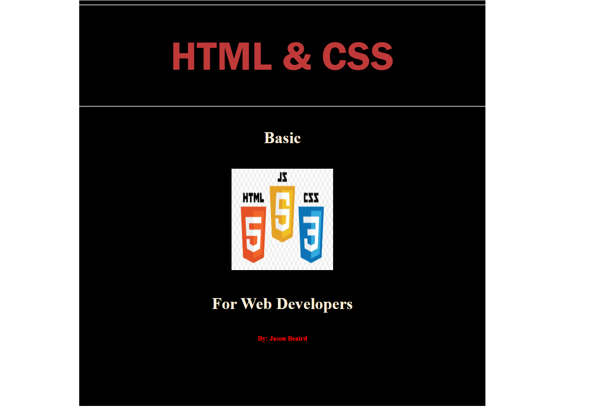

# Ex.06 Book Front Cover Page Design
## Date:

## AIM:
To design a book front cover page using HTML and CSS.

## DESIGN STEPS:

### Step 1:
Create a Django Admin project.

### Step 2:
Create an app in the Django interface.

### Step 3:
Create a folder named 'static' in the app folder.

### Step 4:
Create a new HTML file in the static folder.

### Step 5:
Write the HTML code with relevant CSS properties.

### Step 6:
Choose the appropriate style and color scheme.

### Step 7:
Insert the images in their appropriate places.

### Step 8:
Publish the website in the LocalHost.

## PROGRAM:
~~~
<!DOCTYPE html>
<html lang="en">
<head>
    <meta charset="UTF-8">
    <meta name="viewport" content="width=device-width, initial-scale=1.0">
    <title>HTML & CSS</title>
    
</head>
<body>
    

        

        <h1>HTML & CSS</h1>
        

        <h4>Basic</h4>
        
        <h4>For Web Developers</h4>
        <h5>By: Jason Beaird</h5>
    

</body>
</html>
~~~
## OUTPUT:

## RESULT:
The program for designing book front cover page using HTML and CSS is completed successfully.
